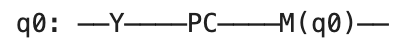
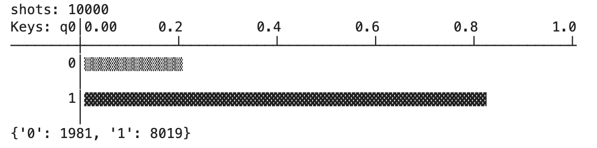
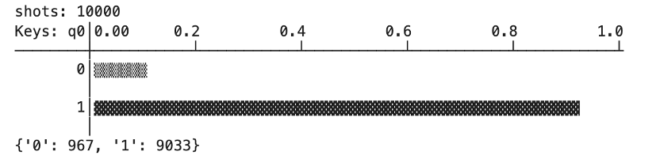
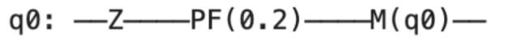
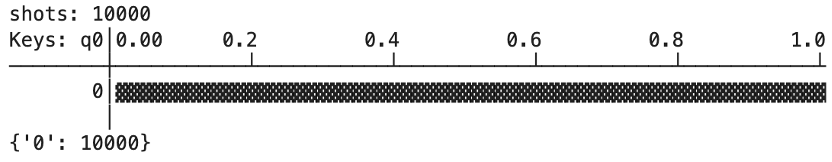
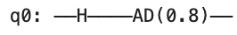
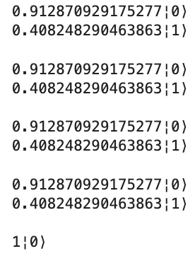
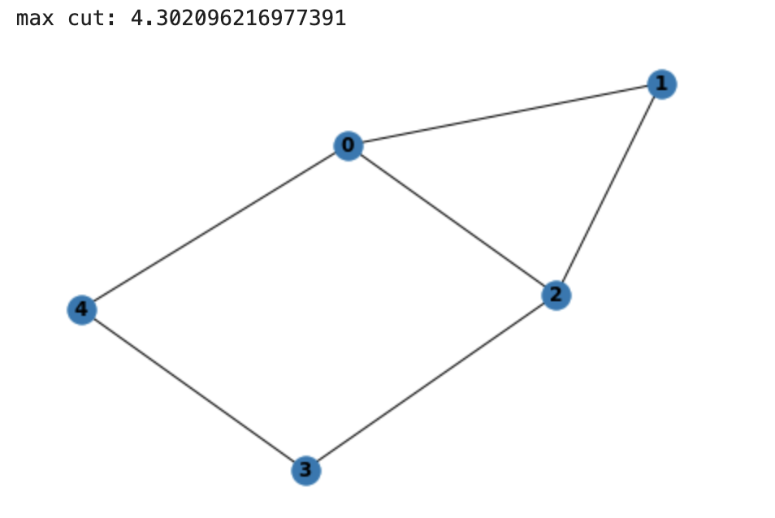
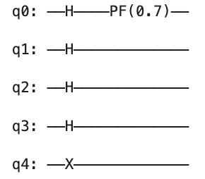

# mindspore-noise
# 量子通道
当你使用量子计算机进行计算时，由于环境的不确定性和误差等因素的干扰，量子比特的状态可能会被扰动。常见的几种噪声模型是Pauli通道，Bit-flip通道，Phase-flip通道和振幅阻尼信道。在这个GitHub仓库中实现了上述噪声模型，以更好地理解和处理量子计算的错误。

## Pauli 通道

Pauli 通道是一种随机地在量子比特上应用 $X$、$Y$ 或 $Z$ 门的通道，或者什么都不做。使用三个参数 $P_x$、$P_y$ 和 $P_z$ 来控制每种门的概率，其中 $P = 1 - P_x - P_y - P_z$ 表示什么都不做的概率。该通道应用的噪声可以表示为以下形式：

$$\varepsilon(\rho) = (1 - P_x - P_y - P_z) \rho + P_x X \rho X + P_y Y \rho Y + P_z Z \rho Z,$$

其中，$\rho$ 是密度矩阵表示的量子态，$P_x$、$P_y$ 和 $P_z$ 是应用 $X$、$Y$ 和 $Z$ 门的概率。

例如，搭建一个量子线路，该比特有 10% 概率以 Pauli 通道额外作用一个 $X$、$Y$、$Z$ 门，如下图所示：
<!--  -->

现在我们对该线路进行10000次模拟并输出采样结果：

倘若没有噪声影响，量子态应该处于|1⟩态，测量结果全为1，但在以上结果中，约有20%的模拟结果测得为0，这就是泡利信道噪声产生的影响。

## 比特翻转通道
比特翻转通道是一种随机地将量子比特从 0 或 1 状态翻转到另一个状态的通道。使用一个参数 p 来控制比特翻转的概率。该通道应用的噪声可以表示为以下形式：

$$\varepsilon(\rho) = (1 - p) \rho + p X \rho X$$

例如，搭建一个量子线路，该比特有10%概率以比特翻转额外作用一个X门，如下图所示：

现在我们对该线路进行10000次模拟并输出采样结果：

以上结果中，约有10%的模拟结果测得为0。

## 相位翻转通道
相位翻转通道是一种随机地将量子比特的相位从 0 或 π 翻转到另一个相位的通道。使用一个参数 p 来控制相位翻转的概率。该通道应用的噪声可以表示为以下形式：

$$\varepsilon(\rho) = (1 - p) \rho + p Z \rho Z$$

例如，搭建一个量子线路，该比特有10%概率以相位翻转额外作用一个Z门，如下图所示：

现在我们对该线路进行10000次模拟并输出采样结果：

## 振幅阻尼通道
振幅阻尼信道是比较常见的信道，其中振幅阻尼信道描述了量子系统能量的耗散，振幅阻尼信道会使量子比特从激发态回到基态。振幅阻尼信道的表达形式为：

$$\varepsilon_{AD}(\rho) = E_0 \rho E_0^{\dagger} + E_1 \rho E_1^{\dagger}$$

例如，搭建一个量子线路，该比特有10%概率以比特翻转额外作用一个$X$门，如下图所示：

现在我们对该线路进行多次演化并输出采样结果：

可见，量子比特经过振幅阻尼信道后能量发生耗散。

相关演示代码见examples文件夹。

# 使用案例
## 最优化
量子近似优化算法（Quantum Approximate Optimization Algorithm，QAOA）是利用量子计算机来近似解决组合优化问题的量子算法，最早由Farhi等人于2014年提出。利用QAOA算法来解决最大割问题（Max-Cut），并引入量子噪声，效果如下：

正确答案为5，引入噪声后为4.3，可见噪声造成了一定的干扰

## 量子相位估计
量子相位估计算法 (Quantum Phase Estimation Algorithm, 简称QPE), 是很多量子算法的关键。假设一个乡正算符 $U$, 这个乡正算符作用在其本征态 $|u\rangle$ 上会出现一个相位 $e^{2 \pi i \varphi}$, 现在我们假设 $U$ 算符的本征值末知, 也就是 $\varphi$ 末知, 但是 $U$ 算符和本征态 $|u\rangle$ 已知, 相位估计算法的作用就是对这个相位 $\varphi$ 进行估计。我们在相位估计算法中引入相关的相位翻转误差,在第一个比特处引入相位翻转噪声，见下图：

估算出的结果如下：

而正确结果是0.125,可见噪声造成了一定的干扰。

具体相关代码见project文件夹。

# 参考文献：
- Nielsen M A, Chuang I. Quantum computation and quantum information[J]. 2002.
- Wang H, Ding Y, Gu J, et al. Quantumnas: Noise-adaptive search for robust quantum circuits[C]//2022 IEEE International Symposium on High-Performance Computer Architecture (HPCA). IEEE, 2022: 692-708.
- Nachman B, Urbanek M, de Jong W A, et al. Unfolding quantum computer readout noise[J]. npj Quantum Information, 2020, 6(1): 84.
